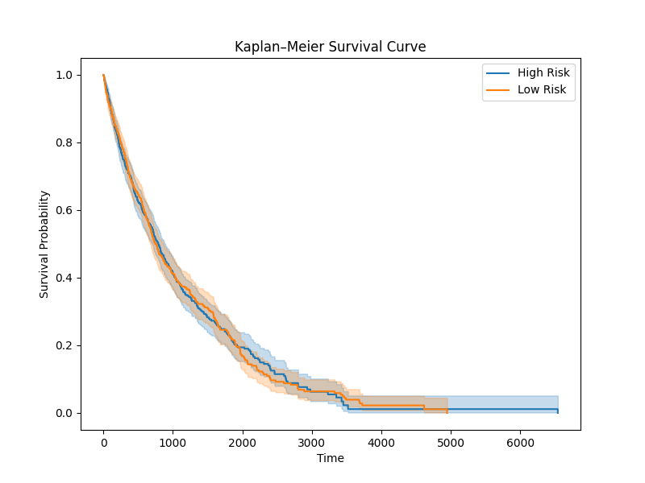
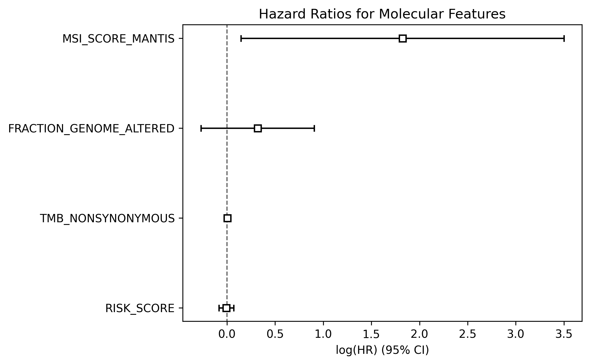

# Oncology Clinical Data Pipeline & Survival Analysis Dashboard

n end-to-end bioinformatics and clinical analytics pipeline for oncology data modeling, biomarker engineering, survival analysis, and interactive visualization using TCGA breast cancer cohort.
Data source: The Cancer Genome Atlas (TCGA) via cBioPortal

---

## Live App
https://oncology-cdm-pipeline.streamlit.app

## GitHub Repo
https://github.com/divyam-vns/oncology-cdm-pipeline

---

This project builds a **clinical-grade oncology data pipeline** that transforms raw cancer genomics data into a structured clinical data model (CDM), enabling survival analysis and biomarker-driven patient stratification.

---

## Key Features

### Clinical Data Modeling
- Transformation of raw clinical data into SDTM-like structure
- Patient-level aggregation from long-format data

### Biomarker Engineering
- Tumor Mutation Burden (TMB)
- Microsatellite Instability (MSI scores)
- Aneuploidy score
- Genome alteration features

### Survival Analysis
- Kaplan–Meier survival curves
- Cox Proportional Hazards model
- Risk stratification using composite scores

### Clinical Simulation
- RECIST-style tumor response classification
- Event-based survival modeling

### Deployment
- Interactive Streamlit dashboard
- Reproducible GitHub-based pipeline

---

## 📊 Key Outputs

### 📉 Kaplan–Meier Survival Curve


### 📊 Cox Proportional Hazards Model


---

## Clinical Relevance

This workflow reflects real-world analytical pipelines used in precision oncology, translational research, and biomarker-driven drug development. Data source: The Cancer Genome Atlas (TCGA) via cBioPortal

---

## Project Structure
```
oncology-cdm-pipeline/
├── data/
│ ├── raw/
│ ├── processed/
├── notebooks/
├── src/
├── outputs/
│ ├── km_final.png
│ ├── cox_forest.png
├── app.py
├── requirements.txt
├── README.md
```
---

## How to Run Locally

```bash
pip install -r requirements.txt
streamlit run app.py
